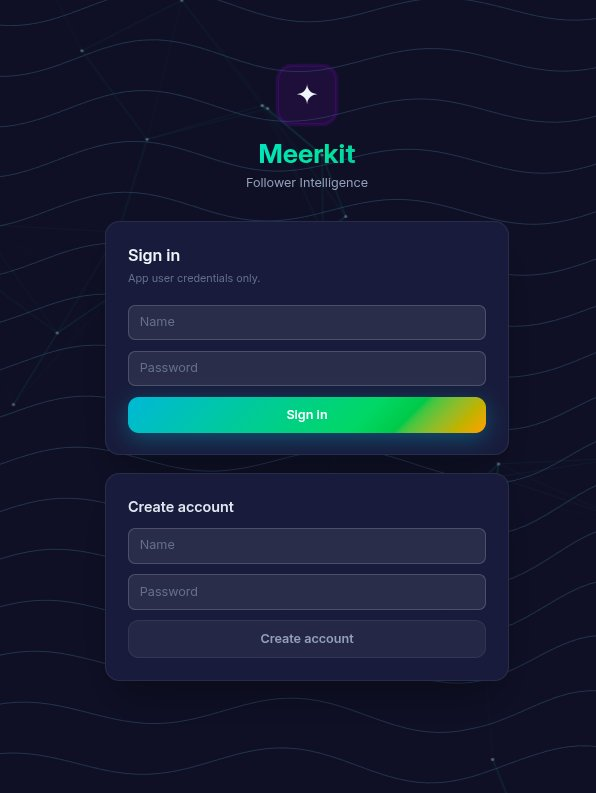
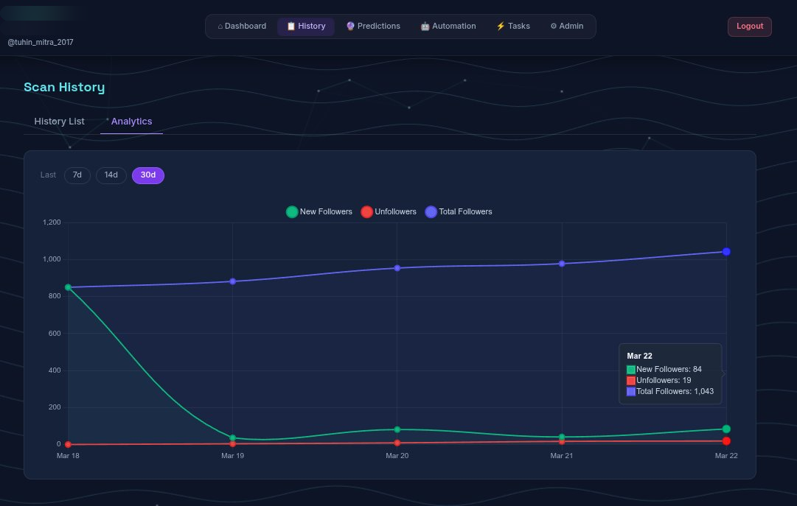
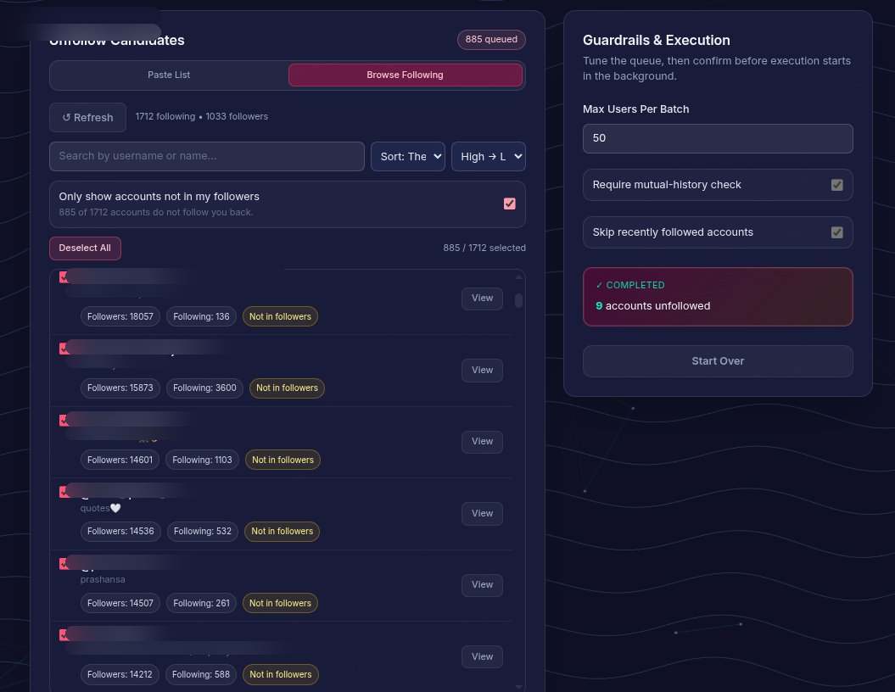
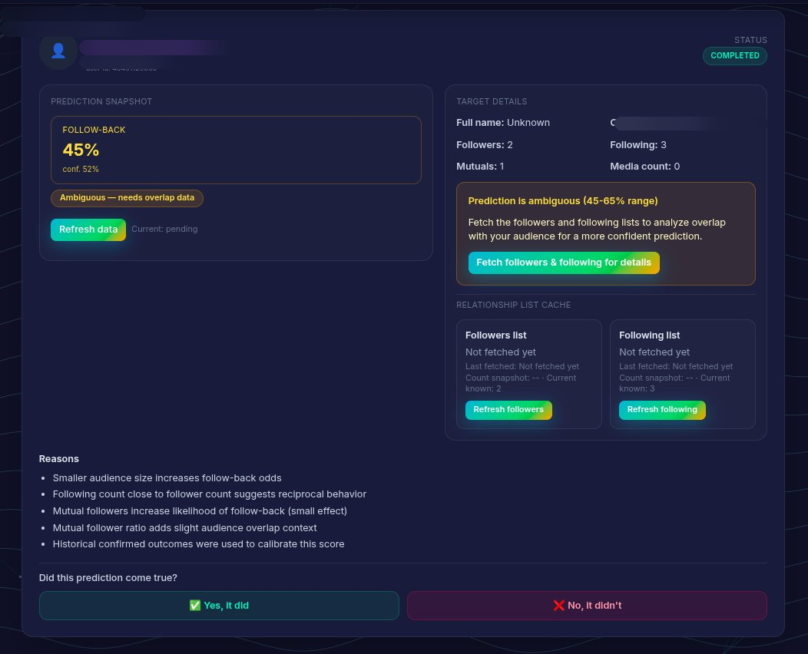

# Meerkit – Instagram Unfollower Tracker & Growth Toolkit

👉🏻 Find out who doesn't follow you back on Instagram and generate a clean unfollower list.

👉🏻 **Meerkit** helps you compare followers vs following, track changes over time, and grow your account with data-driven insights.

👉🏻 Runs locally with full control over your data.

[](https://www.python.org/)
[](https://flask.palletsprojects.com/)
[](https://vuejs.org/)
[](LICENSE)

---

## 🚀 What Meerkit Does

- Find Instagram unfollowers (who doesn’t follow you back)
- Compare followers vs following
- Track follower changes over time
- Batch follow / unfollow with task monitoring
- Predict follow-back probability (growth insights)
- Manage multiple Instagram accounts

---

## 💡 Why Meerkit

Unlike typical Instagram unfollower tools, Meerkit is built for **analysis + automation + experimentation**:

- Real-time scan status + history
- Accurate follower/unfollower diffing
- Profile image caching for faster UI
- Follow-back prediction workflows
- Automation with visibility (not blind scripts)

---

## ⚠️ Important Warning — Instagram Rate Limits

> **Do not bulk follow or unfollow users on Instagram.** Doing so can trigger Instagram's spam detection and may lead to account restrictions.

| Scenario | Safe daily limit |
|---|---|
| General / established accounts | 150 – 200 follow/unfollow actions |
| New accounts (first few weeks) | Stay under 100 actions |

- Spread your actions **gradually throughout the day** to avoid detection.
- If you exceed the limit, Instagram may:
  - Temporarily block your actions (for hours or days)
  - Limit your reach (**shadowban**)
  - **Permanently disable** your account if abuse continues

> **Note:** These limits are not officially confirmed by Instagram — they are based on extensive community testing and experience with Instagram automation tools.

Meerkit provides a built-in **Admin → Account Details → API Usage** tab where you can monitor your live Instagram API call count. See the [API Monitoring section in the Visual Tour](docs/showcase.md#5-api-monitoring-and-limits) for a full walkthrough.

Additionally:

- Use responsibly to avoid platform restrictions
- Automation features are optional and configurable
- Runs locally on your system (no third-party service dependency)

---

## ⚡ Quick Start

```bash
git clone <repo-url>
cd meerkit

uv sync --dev

cd frontend && npm install && cd ..

# terminal 1
uv run flask --app meerkit.app run --debug --port 5000

# terminal 2
cd frontend && npm run dev
```

Open [http://localhost:5173](http://localhost:5173).

Run the backend test suite with:

```bash
uv run pytest
```

If you are already inside an activated virtual environment and want the most deterministic invocation, use:

```bash
python -m pytest
```

Optional deprecation flag for cache migration:

```bash
export LEGACY_USER_DETAILS_CACHE_WRITE_ENABLED=0
```

### Structured Logging Configuration

Meerkit now supports pluggable JSON structured logging with rotating log files.
By default logs are written to `logs/app.jsonl` and rotated automatically.

Set these environment variables to configure behavior:

| Variable | Default | Description |
|---|---|---|
| `LOGGING_ENABLED` | `true` | Enable or disable logging bootstrap |
| `LOG_LEVEL` | `INFO` | Root log level (`DEBUG`, `INFO`, `WARNING`, `ERROR`) |
| `LOG_FILE_PATH` | `logs/app.jsonl` | Output JSONL log file path |
| `LOG_ROTATION_MAX_BYTES` | `10485760` | Rotate after this many bytes (10 MB) |
| `LOG_ROTATION_BACKUP_COUNT` | `5` | Number of rotated backup files to keep |
| `LOG_REDACT_SENSITIVE_FIELDS` | `true` | Redact sensitive fields like cookies/session/csrf |
| `LOG_SUPPRESSED_LOGGERS` | `watchdog.observers.inotify_buffer` | Comma-separated logger names to suppress completely |

Example:

```bash
export LOG_LEVEL=DEBUG
export LOG_FILE_PATH=logs/app.jsonl
export LOG_ROTATION_MAX_BYTES=10485760
export LOG_ROTATION_BACKUP_COUNT=5
export LOG_REDACT_SENSITIVE_FIELDS=true
export LOG_SUPPRESSED_LOGGERS=watchdog.observers.inotify_buffer
```

To plug in external sinks (such as Elasticsearch) later, register a custom handler
with `meerkit.logging_config.register_handler(...)` before app startup.

---

## 📊 Product Preview

| Login + Automation                               | Scan History + Analytics                                           |
| ------------------------------------------------ | ------------------------------------------------------------------ |
|  |         |
|  |  |

| Discovery + Prediction                                                   | Unfollow Flow                                                                            |
| ------------------------------------------------------------------------ | ---------------------------------------------------------------------------------------- |
|                      |  |
|  |                          |

See full walkthrough: [docs/showcase.md](docs/showcase.md)

---

## 📚 Documentation

* Start here: [docs/index.md](docs/index.md)
* Setup: [docs/setup.md](docs/setup.md)
* Architecture: [docs/architecture.md](docs/architecture.md)
* Prediction flow: [docs/prediction-algorithm.md](docs/prediction-algorithm.md)
* Probability model: [docs/probability-model.md](docs/probability-model.md)
* Backend API: [docs/backend.md](docs/backend.md)
* Frontend: [docs/frontend.md](docs/frontend.md)
* Database: [docs/database.md](docs/database.md)
* Full endpoint list: [docs/api-reference.md](docs/api-reference.md)

Run docs locally:

```bash
uv run mkdocs serve
```

---

## 🤝 Contributing

PRs are welcome. Keep changes focused, add tests where possible, and update docs with feature changes.

---

## 📄 License

MIT. See [LICENSE](LICENSE).
