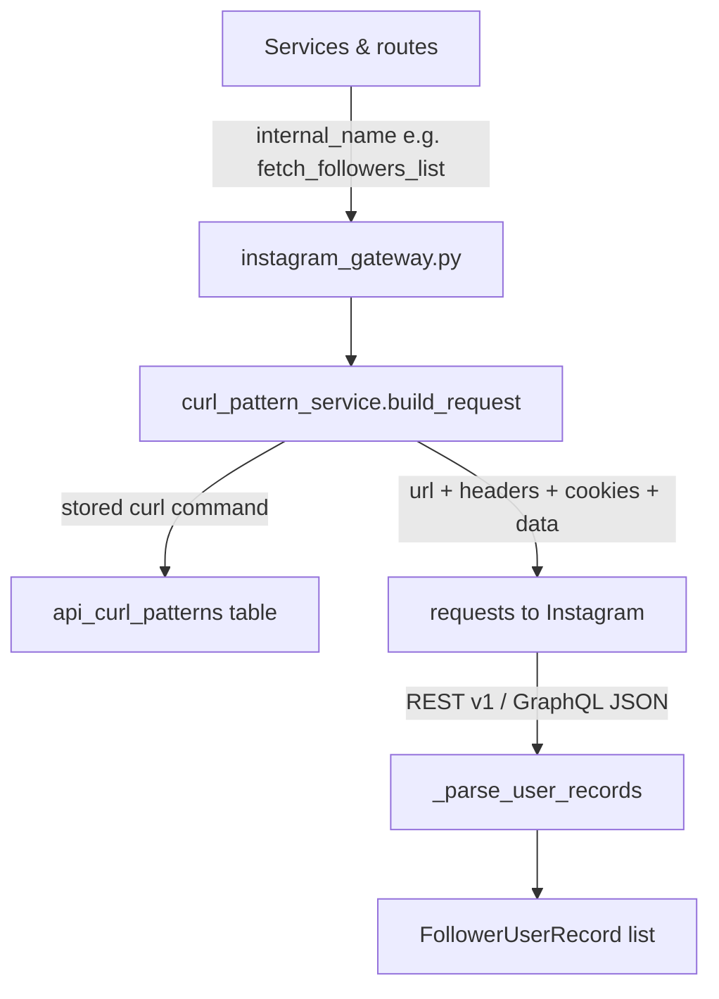

# Architecture

High-level system design for Meerkit.

## System Topology

```text
Vue 3 frontend (Vite)
  -> HTTP /api/*
Flask app (meerkit/app.py)
  -> routes + service layer
  -> SQLite persistence (per-user DB files, incl. api_curl_patterns)
  -> background workers (scan/prediction/automation/download)
  -> filesystem caches (data/cache, data/image_cache, data/diffs)
  -> curl-pattern API gateway (curl_pattern_service + instagram_gateway)
  -> Instagram API (GraphQL + REST v1)
```

## Backend Layers

1. Routes (`meerkit/routes`)
- HTTP contracts and validation.
- Scope resolution via session and active Instagram account.

2. Services (`meerkit/services`)
- Business logic for auth, scan, prediction, automation, cache, persistence.
- Curl pattern service + script generator for the API gateway.

3. DB Layer (`meerkit/db`, `meerkit/services/db_service.py`)
- Schema creation/migrations for new columns.
- Thread-local connection handling.

4. Workers (`meerkit/workers`)
- Queue consumers for image, prediction, automation workloads.

## Route Domains

- Auth + account management (`/api/auth/*`)
- Curl pattern management (`/api/curl-patterns/*`)
- Scan lifecycle + history + diffs (`/api/scan*`, `/api/history`, `/api/diff/*`, `/api/summary`)
- Predictions (`/api/predictions/*`, `/api/prediction-tasks/*`, target relationship-cache endpoints)
- Automation (`/api/automation/*`)
- Unified task board (`/api/tasks`)
- Image serving (`/api/image/<pk_id>`)

## Instagram API Gateway (Curl Patterns)

All live Instagram traffic flows through a **curl-pattern API gateway**. Instead of hardcoded request logic, every operation is executed from a stored `curl` command that the user pastes into the app.



*The gateway resolves a stored curl pattern into a live request and parses the response back into Meerkit's record type.*

- Each operation is keyed by `(app_user_id, internal_name)` in the `api_curl_patterns` table. Core operations: `fetch_user_profile_data`, `fetch_followers_list`, `fetch_following_list`, `follow_user`, `unfollow_user`.
- **Session credentials** (`csrftoken`, `sessionid`, `ds_user_id`) are extracted from stored curl commands via `extract_session_from_curl_pattern()` — never from `instagram_users.json`.
- `parse_curl()` rewrites literal user IDs found in URL paths into the `{{runtime.target_user_id}}` placeholder.
- `build_request()` resolves `{{session.*}}` and `{{runtime.*}}` placeholders, auto-appends `max_id` when paginating, and swaps the numeric user ID inside `/friendships/{id}/` path segments for the runtime `target_user_id`.
- **Pagination**: `_pattern_call_paginated()` walks pages — followers follow the `next_max_id` cursor, following increments a numeric `max_id` by 12 per page — deduplicates by `pk`/`id`, and caps at 50 pages with a 0.3s delay between pages.
- **Response parsing**: `_parse_user_records()` handles both REST v1 (`{"users":[{"pk":...}]}`) and GraphQL (`data.user.edge_followed_by.edges[].node`) shapes.
- Request, header, cookie, and data fields are classified on parse (session / constant / runtime / junk / optional) so users can choose what to send.

## Core Data Flows

!!! warning "⚠️ Instagram Rate Limits Apply"
    Keep follow/unfollow actions under **150–200/day** (new accounts: **under 100/day**). Spread actions gradually throughout the day. [Monitor your API usage →](showcase.md#5-api-monitoring-and-limits)

### 1) Scan Flow

1. Frontend calls `POST /api/scan`.
2. Route extracts session values from the stored curl patterns (`extract_session_from_curl_pattern()`); without at least one pattern it returns a 400 with a setup hint.
3. `scan_runner.start_scan()` acquires per-scope lock and starts thread.
4. `get_current_followers.py:run_scan_for_api()` fetches followers + following through the gateway (`fetch_followers_list` / `fetch_following_list` patterns), force-refreshing the live relationship data.
5. Scan records + diff metadata are stored.
6. Frontend polls `GET /api/scan/status` and refreshes summary/diff/history when done.

### 2) Prediction Flow

1. Frontend calls `POST /api/predictions/follow-back`.
2. Immediate result may be returned, or background task is queued.
3. Worker refreshes prediction and marks task progress/status.
4. Frontend polls prediction task endpoints and can submit feedback.

### 3) Automation Flow

1. Frontend stages action via prepare endpoint.
2. User confirms action (`/actions/<id>/confirm`).
3. Worker executes item-by-item with heartbeat + rate-aware delay; follow/unfollow calls go through the `follow_user` / `unfollow_user` patterns.
4. Status transitions persist in `automation_actions` + `automation_action_items`.

## Scope + Session Design

- Flask session stores app user and active Instagram account.
- Every scoped request resolves context with `get_active_context()`.
- Query override allows selecting explicit profile scope when needed.

## Cache Strategy

- Instagram gateway read-cache envelopes in `data/cache`.
- Optional legacy user detail cache writes controlled by feature flag.
- Relationship cache snapshots for followers/following lists.
- Image cache metadata in DB + files in `data/image_cache`.

## Reliability Patterns

- Stale scan/prediction/automation task detection and error marking.
- Worker thread startup guarded against duplicate startup under Flask reload.
- Background cancellation support for scan, prediction tasks, automation actions.

## Frontend Architecture Notes

- Router-based views in `frontend/src/router/index.ts`.
- TanStack Query for API state, polling, and cache invalidation.
- Dedicated workflows for dashboard, history, discovery, prediction history, tasks, and automation suites.
- Account details page hosts the **API Scripts** tab (`ApiPatternsPanel.vue`) for configuring curl patterns.

See [Backend API](backend.md), [Frontend](frontend.md), [Database](database.md), and [API Reference](api-reference.md).
