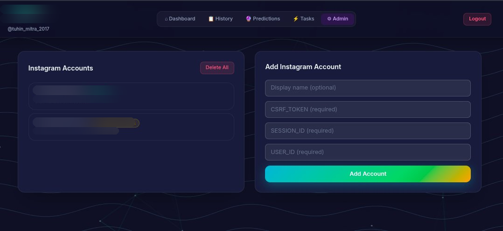

# Backend API

Comprehensive guide to the Flask backend architecture, services, and API design.

## Backend Overview

## Admin Interface



## API Architecture
The backend is a Flask application organized into layers:

1. **Routes** – HTTP endpoint handlers
2. **Services** – Business logic (auth, scanning, persistence)
3. **Database** – SQLite operations and schema
4. **Workers** – Background tasks (scanning, downloading)

## Project Structure

```
backend/
├── app.py                 # Flask app factory
├── config.py              # Configuration
├── extensions.py          # Extensions (DB)
│
├── routes/
│   ├── auth.py           # Authentication endpoints
│   ├── scan.py           # Scan operations
│   ├── history.py        # History and diffs
│   ├── images.py         # Image serving
│   └── __init__.py
│
├── services/
│   ├── db_service.py     # Database operations
│   ├── scan_runner.py    # Scan orchestration
│   ├── auth_service.py   # User authentication
│   ├── persistence.py    # Data persistence
│   ├── image_cache.py    # Image caching
│   └── ...
│
├── db/
│   ├── db_handler.py     # SQLite wrapper
│   ├── schemas.py        # Table definitions
│   └── __init__.py
│
└── workers/
    ├── download_worker.py    # Image downloads
    ├── scan_worker.py        # Scan execution
    └── __init__.py
```

## Key Modules

### app.py

Flask application factory. Initializes the app, configures CORS, and registers blueprints.

```python
def create_app() -> Flask:
    app = Flask(__name__)
    CORS(app, resources={...})

    app.register_blueprint(auth_bp)
    app.register_blueprint(scan_bp)
    # ...

    return app
```

**Key Features:**

- CORS enabled for dev servers (5173, 4173)
- Blueprint registration for modular routes
- Debug reload handling with `WERKZEUG_RUN_MAIN` check

### config.py

Configuration management for paths and settings.

```python
DATA_DIR = Path(__file__).parent.parent / "data"
DIFFS_DIR = DATA_DIR / "diffs"
SCANS_DIR = DATA_DIR / "scans"

def app_user_db() -> Path:
    return DATA_DIR / "app.db"
```

### Routes

#### Auth Routes (`/api/auth`)

```
POST   /auth/register          Register new app user
POST   /auth/login             Log in app user
POST   /auth/logout            Clear session
GET    /auth/me                Get current user context
POST   /auth/instagram-users   Add Instagram account
GET    /auth/instagram-users   List Instagram accounts
GET    /auth/instagram-users/{id}    Get account details
PATCH  /auth/instagram-users/{id}    Update account
POST   /auth/instagram-users/{id}/select    Set active account
DELETE /auth/instagram-users/{id}    Delete account
```

**Example Request/Response:**

```bash
curl -X POST http://localhost:5000/api/auth/login \
  -H "Content-Type: application/json" \
  -d '{"name": "user1", "password": "secret"}'
```

```json
{
  "app_user_id": "user_abc123",
  "name": "user1",
  "instagram_users": [...],
  "active_instagram_user": {...}
}
```

#### Scan Routes (`/api`)

```
POST   /scan                   Start a scan
GET    /scan/status            Get scan status
GET    /summary                Get latest scan summary
POST   /scan/<profile_id>      Start scan for specific profile
```

**Example:**

```bash
# Start scan
curl -X POST http://localhost:5000/api/scan?profile_id=12345

# Poll status
curl http://localhost:5000/api/scan/status?profile_id=12345
```

#### History & Diff Routes (`/api`)

```
GET    /history                Get full scan history
GET    /diff/latest            Get latest diff
GET    /diff/<diff_id>         Get specific diff
```

#### Image Routes (`/api`)

```
GET    /image/<pk_id>          Get cached profile picture
```

### Services

#### db_service.py

Thread-safe database operations with thread-local connections.

**Key Functions:**

```python
def get_worker_db(db_path: Path | None = None) -> SqliteDBHandler:
    """Get or create thread-local DB connection."""

def store_scan_info(scan_id, reference_profile_id, app_user_id, profile_list):
    """Store scan metadata and follower records."""

def generate_scan_diff(latest_scan_id, reference_profile_id, app_user_id):
    """Compute and store diff between scans."""

def cache_image_path(to_insert_data: list[tuple[str, str, str]]):
    """Cache profile image paths."""
```

**Thread Safety:**

```python
_thread_local = threading.local()

def get_worker_db():
    existing = getattr(_thread_local, "db", None)
    if existing and existing.db_path == db_path:
        return existing
    _thread_local.db = SqliteDBHandler(db_path=db_path)
    return _thread_local.db
```

#### scan_runner.py

Orchestrates scan execution and manages scan state.

```python
def start_scan(app_user_id, profile_id, data_dir, credentials, target_user_id) -> bool:
    """Start background scan; returns False if already running."""
    # Acquires lock, updates state, starts worker thread

def get_status(app_user_id, profile_id) -> dict:
    """Get scan status (idle | running | error)."""
```

#### auth_service.py

User registration, login, and credential management.

```python
def register_app_user(name: str, password: str) -> dict:
    """Create new app user."""

def login_app_user(name: str, password: str) -> dict | None:
    """Authenticate user; returns user dict on success."""

def add_instagram_user(...) -> dict:
    """Add new Instagram account to app user."""
```

#### persistence.py

Data persistence layer (scan snapshots, diffs).

```python
def get_latest_scan_meta(reference_profile_id: str):
    """Get metadata for latest scan."""
    # Returns: { scan_id, timestamp, diff_id, follower_count }

def store_scan_info(scan_id, app_user_id, profile_id, profile_list):
    """Persist scan results."""
```

### Workers

#### scan_worker.py

Executes scans in background threads.

```python
def run_scoped_scan(app_user_id, data_dir, csrf_token,
                     session_id, target_user_id) -> dict:
    """
    1. Fetch followers via Instagram API
    2. Store in database
    3. Compute diff against previous scan
    4. Download and cache profile pictures
    5. Return results
    """
```

#### download_worker.py

Background image downloading service.

```python
def start_download_worker():
    """Start persistent background thread for image downloads."""

def queue_image_download(pk_id: str, url: str, local_path: Path):
    """Add image to download queue."""
```

## Session Management

Users are identified via Flask sessions:

```python
session["app_user_id"]               # Current app user
session["active_instagram_user_id"]  # Currently selected IG account
```

Session data is persisted and synced with the database on each request:

```python
def _sync_active_instagram_user_session(app_user_id: str):
    """Keep browser session aligned with DB state."""
```

## Error Handling

All routes follow a consistent error pattern:

```python
@bp.get("/me")
def me():
    current = _current_app_user()
    if not current:
        return jsonify(None)  # Not logged in

    return jsonify(build_response(...))
```

**Status Codes:**

- `200 OK` – Success
- `201 Created` – Resource created
- `202 Accepted` – Async operation started
- `400 Bad Request` – Invalid input
- `401 Unauthorized` – Not logged in
- `404 Not Found` – Resource not found
- `409 Conflict` – Scan already running
- `500 Internal Server Error` – Server error

## CORS Configuration

Dev environment allows requests from:

- `http://localhost:5173` (Vite frontend)
- `http://localhost:4173` (Preview server)

Production should restrict to your domain.

## Environment Variables

```env
FLASK_DEBUG=1                    # Enable debug mode
FLASK_ENV=development           # Environment
APP_SECRET_KEY=your-secret-key  # Session secret
```

## Running the Backend

**Development:**

```bash
flask --app backend.app run --debug --port 5000
```

**Production:**

```bash
FLASK_ENV=production APP_SECRET_KEY=<secure-key> \
  flask --app backend.app run --port 5000
```

Or use a production WSGI server:

```bash
gunicorn -w 4 -b 0.0.0.0:5000 "backend.app:create_app()"
```

## Testing

```bash
# Run all tests
python -m pytest

# Run specific test file
python -m pytest backend/tests/test_auth_service.py

# With coverage
pytest --cov=backend
```

## Common Patterns

### Thread-Safe Database Operations

```python
db = get_worker_db()
with db as conn:
    cursor = conn.cursor()
    cursor.execute("SELECT * FROM scan_history WHERE ...")
    results = cursor.fetchall()
    # Connection auto-closes
```

### Async Scan Execution

```python
# Route accepts immediately
@bp.post("/scan")
def trigger_scan():
    started = scan_runner.start_scan(...)
    if not started:
        return {"error": "Scan already running"}, 409
    return {"message": "scan started"}, 202

# Frontend polls for completion
@bp.get("/scan/status")
def scan_status():
    return get_status(...)
```

### Request Validation

```python
@bp.post("/auth/register")
def register():
    payload = request.get_json(silent=True) or {}
    name = (payload.get("name") or "").strip()

    if not name or not password:
        return {"error": "name and password required"}, 400
```

---

Next: [Frontend Guide](frontend.md) or [Full API Reference](api-reference.md)
