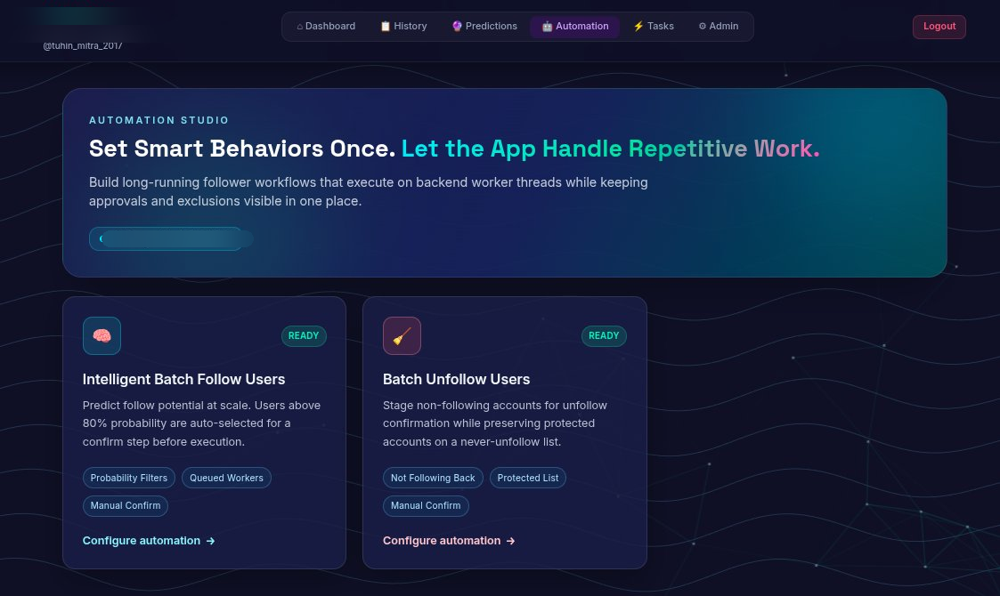
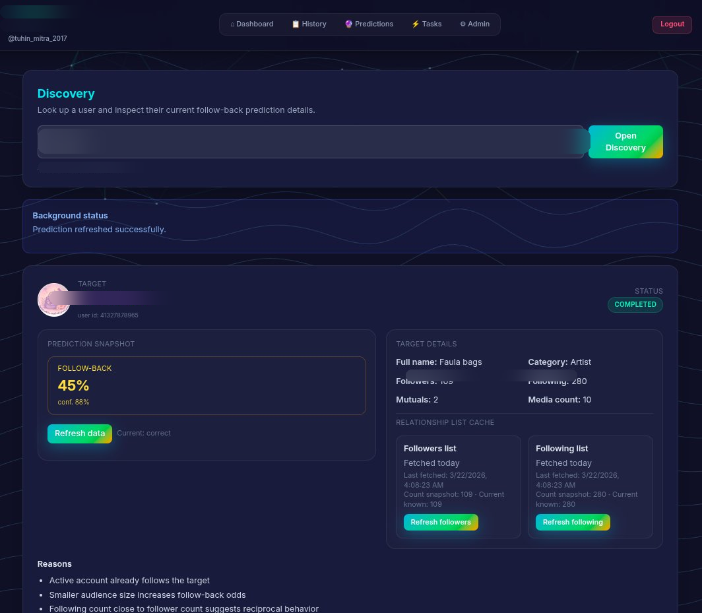
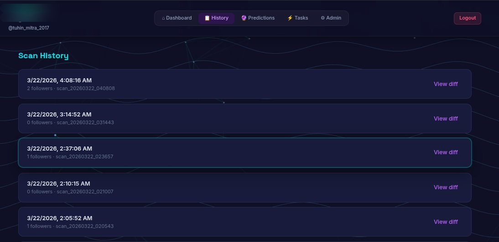

# Home

Meerkit is your follower intel dashboard: scan, compare, predict, and act.

## What You Get

- Fast follower scans
- Clean new vs unfollower diffs
- Scan history and analytics graphs
- Multi-account and credential management
- Follow-back predictions + batch workflows

## Quick Look

| Dashboard | Discovery |
| --- | --- |
|  |  |

| History | Unfollow Workflow |
| --- | --- |
|  |  |

## Start in 2 Minutes

```bash
python3 -m venv .venv
source .venv/bin/activate
pip install -e .
cd frontend && npm install && cd ..
flask --app backend.app run --debug --port 5000
```

In another terminal:

```bash
cd frontend
npm run dev
```

Open http://localhost:5173.

## Explore Docs

- Setup: [Quick Start](setup.md)
- Architecture: [Architecture](architecture.md)
- Prediction flow: [Prediction Algorithm](prediction-algorithm.md)
- Probability reasoning: [Probability Model](probability-model.md)
- API internals: [Backend API](backend.md)
- UI structure: [Frontend](frontend.md)
- Data model: [Database](database.md)
- Endpoints: [API Reference](api-reference.md)
- Full screenshots: [Visual Tour](showcase.md)

## Need Help?

- Report bugs: [GitHub Issues](https://github.com/Tuhin-thinks/meerkit/issues)
- Open discussions: [GitHub Discussions](https://github.com/Tuhin-thinks/meerkit/discussions)
