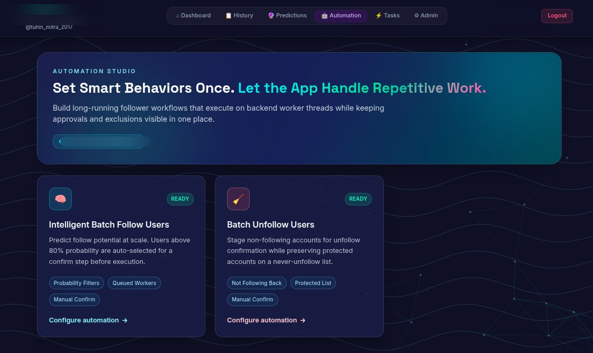
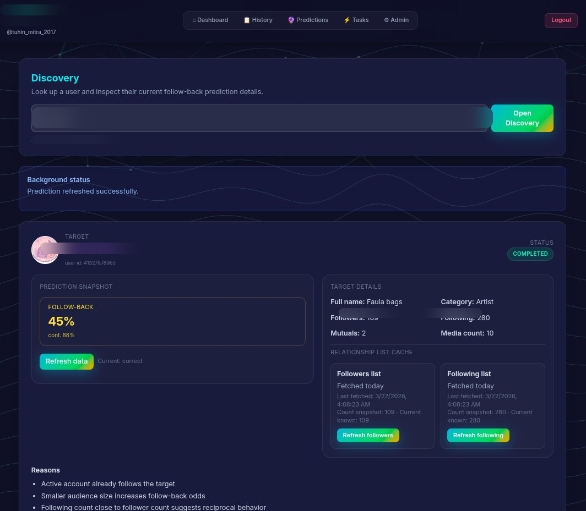
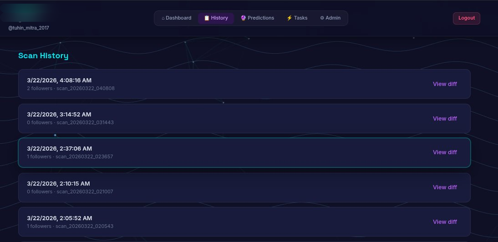

# Home

Meerkit is your follower intel dashboard: scan, compare, predict, and act.

## What You Get

- Fast follower scans
- Clean new vs unfollower diffs
- Scan history and analytics graphs
- Multi-account management via the curl-pattern API gateway
- Follow-back predictions + batch workflows

!!! note "Working again after the Instagram API change"
    Meerkit now talks to Instagram through a **curl-pattern API gateway**. You paste per-operation `curl` commands (captured from your browser's Developer Tools) into the **API Scripts** tab of each account's details page; session credentials are extracted automatically from those commands. See [Architecture](architecture.md) and [Setup](setup.md).

!!! warning "⚠️ Instagram Rate Limit Warning"
    **Do not bulk follow or unfollow users on Instagram.** Doing so can trigger Instagram's spam detection and may lead to account restrictions.

    | Scenario | Safe daily limit |
    |---|---|
    | General / established accounts | 150 – 200 follow/unfollow actions |
    | New accounts (first few weeks) | Stay under 100 actions |

    - Spread your actions **gradually throughout the day** to avoid detection.
    - If you exceed the limit, Instagram may:
        - Temporarily block your actions (for hours or days)
        - Limit your reach (**shadowban**)
        - **Permanently disable** your account if abuse continues

    > **Note:** These limits are not officially confirmed by Instagram — they are based on extensive community testing and experience with Instagram automation tools.

    Monitor your Instagram API call count in the **Admin → Account Details → API Usage** tab. See also: [API Monitoring and Limits](showcase.md#5-api-monitoring-and-limits).

## Quick Look

| Dashboard | Discovery |
| --- | --- |
|  |  |

| History | Unfollow Workflow |
| --- | --- |
|  |  |

## Start in 2 Minutes

```bash
uv sync --dev
cd frontend && npm install && cd ..
uv run flask --app meerkit.app run --debug --port 5000
```

In another terminal:

```bash
cd frontend
npm run dev
```

Open http://localhost:5173.

Run tests with:

```bash
uv run pytest
```

## Explore Docs

- Setup: [Quick Start](setup.md)
- Architecture: [Architecture](architecture.md)
- Prediction flow: [Prediction Algorithm](prediction-algorithm.md)
- Probability reasoning: [Probability Model](probability-model.md)
- API internals: [Backend API](backend.md)
- UI structure: [Frontend](frontend.md)
- Data model: [Database](database.md)
- Endpoints: [API Reference](api-reference.md)
- Full screenshots: [Visual Tour](showcase.md)

## Need Help?

- Report bugs: [GitHub Issues](https://github.com/Tuhin-thinks/meerkit/issues)
- Open discussions: [GitHub Discussions](https://github.com/Tuhin-thinks/meerkit/discussions)
