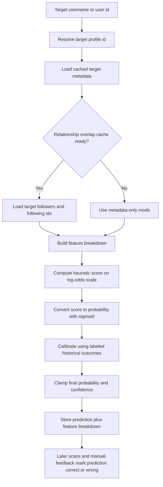

# Prediction Algorithm

This page explains the end-to-end algorithm Meerkit uses to estimate the chance that a target account will follow back.

The goal is not to claim certainty. The goal is to produce a useful, explainable ranking signal from the data Meerkit can actually observe:

- Target profile metadata
- Mutual follower context
- Follower and following overlap against the active account's latest scanned audience
- Previously confirmed prediction outcomes for the same reference account

## What The Algorithm Is Trying To Answer

The question is practical:

> Given what the app knows right now, how likely is this target to reciprocate a follow?

That means the model is intentionally:

- **Behavioral, not social-graph complete**: it only uses data the app can fetch or cache.
- **Heuristic-first**: it starts from interpretable rules instead of a black-box model.
- **History-calibrated**: it adjusts raw heuristic output using past confirmed outcomes.
- **State-aware**: it returns not only a probability, but also confidence and fetch-status flags.

## End-To-End Flow

## Data Sources Used By The Algorithm

### 1. Target profile facts

These are the direct account-level signals used by the model:

- Whether the target already follows the active account
- Whether the active account already follows the target
- Whether the target is private
- Whether the target is verified
- Follower count
- Following count
- Mutual follower count
- Media count
- Category
- Professional-account flag
- Biography text length
- Highlight-reel presence

These values are pulled from cached target profile metadata or from a refresh when the app fetches fresh prediction data.

### 2. Relationship overlap data

If relationship-cache data is available, the algorithm compares the target's graph against the active account's latest scanned follower snapshot.

It computes two overlap families:

- **Follower overlap**: how many of the target's followers are already in the active audience snapshot
- **Following overlap**: how many accounts the target follows are already in the active audience snapshot

This gives the model a stronger signal than metadata alone, because it can see whether the target already lives near the same audience cluster.

### 3. Historical confirmed outcomes

The model does not stop at heuristics. It also looks at previously labeled predictions for the same active/reference account pair.

Only completed predictions with confirmed outcomes are used:

- `correct`
- `wrong`

Predictions where the target already followed the account are excluded from the historical calibration cohort, because those cases are too easy and would distort the useful middle of the distribution.

## The Core Steps

## 1. Start With A Baseline

The algorithm starts from a baseline prior of roughly `28%` follow-back likelihood.

It does not begin at `50%`, because reciprocal follows are not treated as neutral coin flips. The baseline reflects a more conservative assumption before strong evidence appears.

## 2. Move Into Log-Odds Space

Instead of adding directly to probability, the model converts the baseline probability into **log-odds** and adds feature effects there.

This matters because it lets multiple weak signals accumulate in a stable way without causing the probability to behave erratically near `0` or `1`.

The raw heuristic stage therefore looks like this:

$$
\text{score} = \text{logit}(0.28) + \sum \text{feature adjustments}
$$

The final heuristic probability before calibration is:

$$
\text{probability} = \sigma(\text{score}) = \frac{1}{1 + e^{-\text{score}}}
$$

The detailed factor list is covered in [probability-model.md](probability-model.md).

## 3. Build A Feature Breakdown

The system stores a structured feature breakdown with every prediction. This is important for two reasons:

- It supports user-facing explanations in the UI.
- It lets history-based calibration compare similar predictions to each other later.

The breakdown includes both raw numbers and buckets such as:

- `target_size_bucket`: `tiny`, `small`, `mid`, `large`, `massive`
- `mutual_bucket`: `none`, `low`, `medium`, `high`
- `overlap_followers_bucket`: `none`, `low`, `medium`, `high`
- `overlap_following_bucket`: `none`, `low`, `medium`, `high`
- `graph_fetch_status`: `metadata_only`, `partial`, `ready`

The model also stores overlap ratios against the active audience snapshot, which makes the same absolute overlap count mean different things depending on audience size.

## 4. Distinguish Metadata-Only From Full-Graph Scoring

The algorithm can run in different data states:

- `metadata_only`: no relationship graph data yet
- `partial`: only one side of the relationship graph is cached
- `ready`: both followers and following caches are available

This is a deliberate design choice.

Meerkit can produce a fast first-pass estimate from metadata, then refine it after the heavier relationship fetch completes. That makes prediction usable in interactive workflows while still rewarding fresher graph data with better calibration and higher confidence.

## 5. Calibrate With Historical Outcomes

After the heuristic probability is computed, the algorithm looks at previous predictions for the same active account and builds a historical reference.

It matches the current target against prior predictions using cohort keys such as:

- Size bucket
- Private vs public
- Professional vs non-professional
- Verified vs non-verified
- Mutual bucket
- Overlap follower bucket
- Overlap following bucket
- Graph-fetch status
- Whether the active account already follows the target

Instead of relying on an exact full-row match, the algorithm aggregates evidence across these feature cohorts and computes a smoothed posterior rate for each matched dimension.

That makes calibration:

- More stable with limited history
- Less brittle than exact pattern matching
- Easier to explain

The history stage can contribute up to half of the final probability weight, but never more.

## 6. Produce Confidence Alongside Probability

Probability answers "how likely?"

Confidence answers "how much evidence is this estimate standing on?"

Confidence increases when the system has:

- Cached target profile data
- Relationship overlap data
- A meaningful number of historical labeled outcomes
- A richer metadata profile, such as longer biography or highlight reels

This separation is intentional. A prediction can have:

- High probability but only medium confidence
- Moderate probability and high confidence
- Ambiguous probability with low confidence when evidence is thin

## 7. Mark Ambiguous Cases Explicitly

Probabilities in the middle band are marked as ambiguous. In practice this means the model can tell the UI:

- this target is promising
- this target is weak
- this target is unclear and may need more data

That is better than forcing a false sense of precision for borderline cases.

## 8. Close The Loop With Real Outcomes

The algorithm is not one-shot.

Predictions are later reconciled using:

- New follower scans
- Manual feedback
- Expiration logic when a predicted follow-back never happens

Those outcomes are written back as prediction assessments and reused later by the historical calibration step. This gives the system a controlled feedback loop without introducing a heavy machine-learning training pipeline.

## Why This Design Was Chosen

## Interpretable Over Opaque

Each major factor has a readable explanation in the UI and a stable meaning in the code. That makes the system debuggable and helps users understand why two similar-looking accounts can score differently.

## Fast First, Better Later

Metadata-only scoring gives immediate answers. Relationship overlap and historical calibration improve those answers when more data is available.

## Personalized Per Active Account

Historical calibration is scoped to the same active/reference account rather than being global across all users. That is important because follow-back patterns are audience-specific.

## Conservative Extremes

The final probability is clamped away from absolute certainty. Even a very strong case stays below `97%`, and even a very weak case stays above `3%`.

That keeps the output realistic and prevents the interface from presenting social predictions as hard facts.

## What This Algorithm Does Not Claim

The model is useful, but it is not magic.

It does not know:

- private off-platform context
- timing effects outside the observed scan window
- content quality in a semantic sense
- real human intent beyond the signals available to the app

So the output should be treated as a ranking and prioritization signal, not a guaranteed outcome.

## Related Docs

- [Probability Model](probability-model.md)
- [Frontend](frontend.md)
- [Backend API](backend.md)
- [API Reference](api-reference.md)
