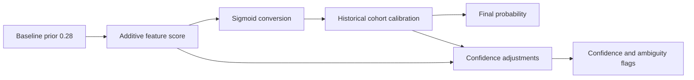

# Probability Model

This page explains the exact notion Meerkit uses to turn account signals into a follow-back probability, and why each factor exists.

## Summary

Meerkit uses a **hybrid heuristic + calibration model**:

1. Start from a conservative baseline probability.
2. Add interpretable feature adjustments on a log-odds scale.
3. Convert that score to probability with a sigmoid.
4. Blend the result with historical success rates from similar past predictions.
5. Return both probability and confidence.

## 1. Baseline Prior

The raw model starts from:

$$
p_0 = 0.28
$$

This is converted into log-odds before feature adjustments are applied:

$$
\text{logit}(p) = \ln\left(\frac{p}{1-p}\right)
$$

### Why start at 28%

The algorithm assumes that most targets are **not** naturally coin-flip reciprocity cases. A lower prior makes the model earn higher probabilities through evidence instead of drifting upward too easily.

## 2. Why The Model Works In Log-Odds Space

Feature adjustments are added to a score, not directly to the final probability.

That gives three practical advantages:

- Weak signals combine smoothly.
- Strong signals saturate naturally after sigmoid conversion.
- The model remains interpretable without needing a trained classifier.

The heuristic stage is:

$$
\text{score} = \text{logit}(0.28) + \sum_i w_i
$$

and then:

$$
p_{\text{heuristic}} = \sigma(\text{score}) = \frac{1}{1 + e^{-\text{score}}}
$$

## 3. Factor Families

## Relationship-state factors

These are the strongest direct behavioral signals.

| Factor                                | Approximate effect                              | Why it matters                                                                  |
| ------------------------------------- | ----------------------------------------------- | ------------------------------------------------------------------------------- |
| Target already follows active account | Raises score to at least about `82%` equivalent | This is effectively direct evidence of reciprocity already existing             |
| Active account already follows target | `+0.20` score                                   | A follow is more likely to be returned when the connection is already initiated |
| Private account                       | `-0.28` score                                   | Private accounts are typically more selective                                   |
| Public account                        | `+0.06` score                                   | Public profiles are a bit less restrictive                                      |
| Verified account                      | `-0.38` score                                   | Verified profiles usually behave more like asymmetric audience accounts         |

### Why these factors exist

They represent actual relationship friction. Private and verified profiles usually have more selective or asymmetric follow behavior, while existing follow state is a direct social signal rather than a proxy.

## Audience-size and ratio factors

The model does not just ask how big the account is. It also asks how reciprocal the account _looks_ from its follower/following shape.

| Factor                      | Effect style                                                                | Why it matters                                                                                              |
| --------------------------- | --------------------------------------------------------------------------- | ----------------------------------------------------------------------------------------------------------- |
| Follower count              | Continuous log-scale adjustment, roughly capped between `-0.42` and `+0.22` | Smaller accounts are usually closer to reciprocal-follow behavior; very large audiences are less reciprocal |
| Following-to-follower ratio | Continuous `tanh` adjustment, capped by shape                               | Accounts that follow back more often tend to have following counts that are closer to their follower counts |

### Why not use hard thresholds only

Hard buckets are useful for history calibration, but continuous adjustments are better for the live heuristic score. They avoid sudden jumps where two near-identical accounts fall on opposite sides of an arbitrary threshold.

## Mutual-follower factors

| Factor                   | Approximate effect                              | Why it matters                                                               |
| ------------------------ | ----------------------------------------------- | ---------------------------------------------------------------------------- |
| Mutual followers count   | Up to `+0.22` score                             | Mutuals indicate local social proximity                                      |
| Mutual-to-follower ratio | Up to `+0.12` score when ratio is at least `3%` | Mutuals mean more when they are dense relative to the target's audience size |

### Why the effect is intentionally small

Mutuals are helpful, but they are not enough on their own. The code treats them as **supporting context**, not as a dominant shortcut. That avoids overrating targets just because they sit near a shared cluster.

## Metadata factors

| Factor                            | Approximate effect | Why it matters                                                                                                     |
| --------------------------------- | ------------------ | ------------------------------------------------------------------------------------------------------------------ |
| Very high media count (`>= 1000`) | `-0.16` score      | Extremely high output often correlates with broadcasting rather than reciprocal behavior                           |
| Public-figure style category      | `-0.18` score      | Categories like artist, creator, celebrity, musician, and public figure often map to one-to-many audience patterns |
| Professional account flag         | `-0.14` score      | Professional accounts are slightly less reciprocal on average                                                      |

### Confidence-only metadata factors

Some metadata does not directly raise or lower probability. Instead it raises confidence because it means the app has a richer profile snapshot:

- Biography length of at least `80` characters: `+0.03` confidence
- Highlight reels present: `+0.02` confidence

### Why separate probability from confidence here

Biography length or highlight reels do not reliably imply reciprocal behavior by themselves. They do, however, signal that the account metadata is richer and less sparse, which helps the system trust the estimate slightly more.

## Overlap factors

If relationship graph data is available, the model compares the target's network to the active account's latest scanned follower set.

There are two overlap notions:

- **Follower overlap**: the target is followed by people already in the active audience
- **Following overlap**: the target follows people already in the active audience

| Factor                                        | Approximate effect  | Why it matters                                                                             |
| --------------------------------------------- | ------------------- | ------------------------------------------------------------------------------------------ |
| Overlap followers count                       | Up to `+0.50` score | The target is already adjacent to the audience that matters to the active account          |
| Overlap following count                       | Up to `+0.42` score | The target already points attention toward the same audience neighborhood                  |
| Overlap followers ratio vs reference audience | Up to `+0.35` score | Raw overlap count should mean more when it forms a meaningful share of the active audience |
| Overlap following ratio vs reference audience | Up to `+0.28` score | Same idea for following-side overlap                                                       |

### Why overlap is powerful

This is the most graph-aware part of the model. Unlike profile metadata, overlap says something about **network proximity** rather than just account presentation.

### Why overlap is optional

Fetching relationship graphs is heavier than reading cached profile metadata. So the system can run in metadata-only mode first and then improve the score when cached follower/following data becomes available.

## 4. Historical Calibration

After the heuristic probability is computed, Meerkit calibrates it using past confirmed outcomes for the same active/reference account.

## Which past rows are eligible

Historical rows must be:

- Labeled `correct` or `wrong`
- Stored with feature breakdown data
- Not cases where the target already followed the account

The last exclusion matters because those cases are too obvious and would inflate historical rates in a misleading way.

## Cohort keys used for matching

The current prediction is compared against prior labeled rows using these cohort dimensions:

- Target size bucket
- Private flag
- Professional-account flag
- Verified flag
- Mutual bucket
- Overlap followers bucket
- Overlap following bucket
- Graph-fetch status
- Whether the active account already follows the target

## Smoothing and posterior calculation

The model computes a global historical rate first, then uses it as a prior when estimating each cohort-specific posterior.

Conceptually it does this:

$$
\text{posterior} = \frac{\text{wins} + \text{global rate} \cdot 8}{\text{total} + 8}
$$

This prevents small cohorts from overreacting to sparse data.

### Why smoothing is necessary

Without smoothing, a cohort with `1/1` correct would look like `100%`, which is not credible. Smoothing keeps the model stable when history is still limited.

## How history influences the final score

The calibration weight grows with sample count but is capped at `0.5`.

That means history can shape the final probability strongly, but it can never fully override the live heuristic.

The blended result is:

$$
p_{\text{final}} = p_{\text{heuristic}} (1-w) + p_{\text{historical}} w
$$

where:

- $p_{\text{heuristic}}$ is the score from current target features
- $p_{\text{historical}}$ is the calibrated cohort rate
- $w \le 0.5$

### Why cap history at 50%

Current target evidence still matters. Historical outcomes are useful, but they are a calibration layer, not a replacement for the actual observed target profile.

## 5. Confidence Model

Confidence starts low and rises as the app gathers more evidence.

### Main confidence contributors

- Base confidence: `0.24`
- Target profile exists: `+0.14`
- Target already follows active account: `+0.12`
- Mutual count available: up to `+0.08`
- Overlap followers available: `+0.10`
- Overlap following available: `+0.08`
- Any target graph data available: `+0.16`
- Rich biography: `+0.03`
- Highlight reels: `+0.02`
- Historical sample count at least `20`: up to `+0.16`

### Why confidence is separate from probability

Probability answers whether the target looks likely to follow back.

Confidence answers whether the app had enough evidence to make that estimate robust.

That is why metadata-only predictions can be directionally useful but still less trustworthy than overlap-backed predictions.

## 6. Final Guardrails

Meerkit applies a few explicit guardrails before returning the result.

### Probability clamp

Final probability is clamped between `3%` and `97%`.

### Confidence clamp

Confidence is also clamped into a valid normalized range.

### Ambiguity band

Predictions between `45%` and `65%` are marked as ambiguous.

### Why these guardrails exist

The system is designed for decision support, not absolute certainty. Guardrails prevent overclaiming and help the UI distinguish strong recommendations from borderline ones.

## 7. Why The Algorithm Uses These Particular Notions

## History-based prediction

Because each active account attracts a different kind of audience, the best calibration is not global platform-wide behavior. It is **account-local historical behavior**.

## Follower/following overlap

Overlap is the most direct approximation of network closeness that the app can compute from cached graph data. It is stronger than simple mutual counts because it uses the active account's actual scanned audience as the reference set.

## Mutual followers

Mutuals are still useful, but they are intentionally weaker than full overlap. They capture social adjacency but not the same depth of audience embedding.

## Account size and ratio behavior

These features approximate whether the account behaves like:

- a reciprocal personal account
- a selective niche account
- a large asymmetric audience account

## Metadata richness

Metadata richness mostly improves confidence because it tells the system that it is reasoning from a more complete snapshot rather than sparse profile data.

## 8. Reading The Output Correctly

A prediction should be interpreted like this:

- **Probability**: estimated chance of follow-back
- **Confidence**: how much evidence supports that estimate
- **Reasons**: the strongest human-readable explanations for the score
- **Graph fetch status**: how complete the overlap data is
- **Historical reference count/rate**: how much past labeled behavior influenced calibration

In other words, the answer is not just a number. It is a number plus the evidence shape behind it.

## Related Docs

- [Prediction Algorithm](prediction-algorithm.md)
- [Frontend](frontend.md)
- [Backend API](backend.md)
